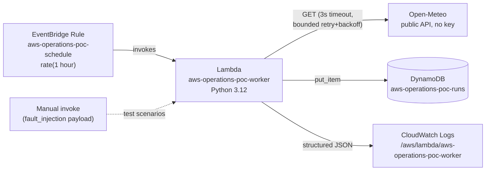

# aws-operations-poc

A small, real, deployed AWS portfolio POC: a scheduled Lambda that calls a
public API, survives (and proves it survives) a controlled transient
failure, and leaves an auditable trail of exactly what happened.

## Problem being demonstrated

Production operations questions this POC answers with evidence, not
assertions:

- Does a scheduled job actually run on schedule, unattended?
- When a downstream dependency fails transiently, does the system recover
  automatically, and can you prove it did -- with a bounded number of
  retries, never an infinite loop?
- When a downstream dependency fails permanently, does the system fail
  closed (bounded attempts, clear failure record) instead of retrying
  forever or silently losing the failure?
- Is every run -- success or failure -- persisted as structured evidence
  that can be queried later, not just logged and forgotten?
- Can all of this be built, tested, and deployed through CI/CD with no
  long-lived AWS credentials and no IAM changes?

## Architecture



One function, one table, one schedule, one log group. No queues, no state
machine, no API Gateway -- nothing the objective doesn't need.

## AWS services

| Service | Resource | Purpose |
|---|---|---|
| Lambda | `aws-operations-poc-worker` | Runs the workload |
| EventBridge | `aws-operations-poc-schedule` | Triggers it hourly; `MaximumRetryAttempts: 0` so the platform never stacks its own retries on top of the function's internal bounded retry |
| DynamoDB | `aws-operations-poc-runs` | Persisted run evidence, on-demand billing |
| CloudWatch Logs | `/aws/lambda/aws-operations-poc-worker` | Structured JSON logs, 14-day retention |

All resource **names** are prefixed `aws-operations-poc-`; everything is
tagged `Project=aws-operations-poc`; everything lives in one CloudFormation
stack, `aws-operations-poc-main`, in `us-east-2`.

## Why the Lambda code is inlined, not zipped to S3

This account's deploy identity (and, verified live, the CloudFormation
service role it uses) has no `s3:CreateBucket` / `s3:PutObject`
permissions at all -- there is no permitted path to get a deployment
package into S3. `src/app.py` is therefore small enough to inline directly
as `AWS::Lambda::Function.Code.ZipFile` (CloudFormation's 4096-character
limit for that field). `scripts/render_template.py` generates the deployed
template from the real, tested `src/app.py` via `ast.unparse` (strips
comments/docstrings, changes nothing else) and fails the build loudly if it
would ever exceed the limit -- so the deployed code and the tested code can
never drift, and there's no silent truncation. Full reasoning and every
permission probe behind this decision is in
[`docs/AWS_BOUNDARY.md`](docs/AWS_BOUNDARY.md).

## Failure injection and bounded recovery

The handler runs up to `MAX_ATTEMPTS` (default 3) attempts with exponential
backoff (`BACKOFF_BASE_SECONDS * 2^(attempt-1)`), and **always returns
normally** -- it never raises out of the handler, so it can never trigger
Lambda/EventBridge's own async retry on top of its internal one. Fault mode
is controlled per-invocation by the `fault_injection` field in the event
payload (disabled by default, so scheduled runs are never affected unless
explicitly overridden via the `FaultInjectionDefault` stack parameter):

| `fault_injection` | Behavior |
|---|---|
| absent / `"false"` | Real call to the public API (normal operation) |
| `"transient"` | Attempt 1 deterministically fails; attempt 2 calls the real API and (normally) succeeds -- proves bounded automatic recovery |
| `"permanent"` | Every attempt deterministically fails -- proves retry exhaustion stops at `MAX_ATTEMPTS`, never loops |

## Persisted evidence

Every attempt (not just the final outcome) is written to
`aws-operations-poc-runs` and logged as one structured JSON line:

```json
{"run_id": "...", "timestamp": "...", "trigger_type": "scheduled|manual",
 "attempt_number": 1, "external_request_result": "...",
 "status": "success|failure", "recovery_state": "not_needed|recovered|retrying|exhausted",
 "latency_ms": 12.3}
```

`run_id` + `timestamp` is the DynamoDB key, so every attempt of a single
invocation is queryable as a group.

## Observability

Every log line is a single JSON object (`log_event` in `src/app.py`), so
CloudWatch Logs Insights can query on any field (`status`, `recovery_state`,
`trigger_type`, ...) without a log-parsing pipeline. A DynamoDB write
failure is caught and logged (`evidence_write_failed`) rather than crashing
the run -- observability degrades gracefully instead of taking the
workload down with it.

## Cost-conscious design

- DynamoDB: on-demand (`PAY_PER_REQUEST`) billing -- no idle capacity cost.
- Lambda: 128 MB, ~20s timeout ceiling, hourly schedule -- effectively free
  tier for a portfolio-scale demo.
- CloudWatch Logs: 14-day retention instead of indefinite.
- No NAT gateway, no VPC, no S3 bucket, no always-on compute.

## Security model

- The deploying identity (`claude-poc-role`) is CloudFormation-lifecycle-only:
  verified live to have `CreateStack`/`UpdateStack`/`DescribeStacks`/
  `ValidateTemplate`/`GetTemplate` and nothing else service-specific --
  see [`docs/AWS_BOUNDARY.md`](docs/AWS_BOUNDARY.md) for every permission
  probed.
- This project creates **no IAM roles or policies**. The Lambda runs under
  a pre-provisioned `aws-operations-poc-lambda-role`; CloudFormation itself
  deploys under a pre-provisioned `aws-operations-poc-cfn-role`, passed
  explicitly via `--role-arn` on every stack operation.
- No secrets, no API keys: the public API requires none, and CI/CD assumes
  AWS credentials via GitHub OIDC (no long-lived access keys stored
  anywhere).

## CI/CD path

- **CI** (`.github/workflows/ci.yml`): every PR and push runs the unit
  tests, renders the CloudFormation template from `src/app.py`, and lints
  it with `cfn-lint`. No AWS credentials are used or required.
- **CD** (`.github/workflows/cd.yml`): on push to `main`, re-runs tests and
  rendering, then assumes an AWS role via OIDC (`id-token: write`, no
  long-lived keys) and runs `scripts/deploy.sh`, which deploys
  `aws-operations-poc-main` using the pre-provisioned CloudFormation service
  role.
  **Bootstrap dependency:** the GitHub OIDC provider/role this workflow
  assumes does not exist yet in this AWS account and was not created here
  (creating it means creating IAM resources, which this project's operating
  rules prohibit). See [`docs/AWS_BOUNDARY.md`](docs/AWS_BOUNDARY.md) for
  the exact minimum role/policy to bootstrap and the repo secret
  (`AWS_DEPLOY_ROLE_ARN`) to set. Until then, deployment is run from a
  workstation with the `claude-poc` profile via `scripts/deploy.sh`
  directly -- which is how this stack was actually deployed.

## How to reproduce

```bash
# 0. Install dev/runtime-import dependencies (boto3 is preinstalled in the
#    Lambda runtime, but not on a fresh machine/CI runner, and src/app.py
#    imports it at module load, so tests need it installed explicitly)
pip install -r requirements-dev.txt

# 1. Run the deterministic, offline test suite
python3 -m unittest discover -s tests -v

# 2. Render the CloudFormation template (inlines src/app.py, enforces the
#    4096-char ZipFile limit) and validate it
python3 scripts/render_template.py
aws cloudformation validate-template --template-body file://infra/template.rendered.yaml

# 3. Deploy (creates or updates aws-operations-poc-main)
bash scripts/deploy.sh

# 4. Exercise all three scenarios against the live function (requires
#    lambda:InvokeFunction + dynamodb:Query -- see docs/AWS_BOUNDARY.md)
bash scripts/invoke_demo.sh
```

## Repository layout

```
src/        Lambda handler (single source of truth for both tests and the deployed code)
tests/      Deterministic, offline unit tests (no network, no AWS calls)
infra/      CloudFormation template + the render script that inlines src/app.py into it
scripts/    deploy.sh, render_template.py, invoke_demo.sh
requirements-dev.txt  boto3, needed to import src/app.py outside the Lambda runtime (tests, cfn rendering)
docs/       AWS permission boundary, findings from the live account
.github/workflows/  CI (test+lint) and CD (deploy via OIDC)
```
