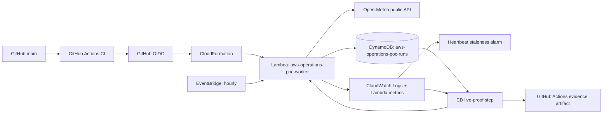

# Autonomous AWS Operations Lab

`aws-operations-poc` is a compact AWS operations project designed to prove that a small workload can be built, tested, deployed, observed, deliberately failed, automatically recovered, and audited end to end.

The neutral workload is weather data. The engineering demonstration is the point.

## End-to-end path

```text
GitHub change
→ deterministic tests
→ CloudFormation validation
→ GitHub OIDC authentication
→ AWS deployment
→ scheduled Lambda workload
→ public API call
→ CloudWatch logs + metrics + heartbeat alarm
→ DynamoDB execution evidence
→ controlled failure
→ automatic bounded recovery
→ machine-readable live proof artifact
```

## Architecture



The stack is `aws-operations-poc-main` in `us-east-2`.

## AWS resources

| Service | Resource | Purpose |
|---|---|---|
| Lambda | `aws-operations-poc-worker` | Python 3.12 workload and bounded recovery loop |
| EventBridge | `aws-operations-poc-schedule` | Hourly unattended execution |
| DynamoDB | `aws-operations-poc-runs` | Durable per-attempt evidence |
| CloudWatch Logs | `/aws/lambda/aws-operations-poc-worker` | Structured JSON operational logs |
| CloudWatch Metrics | Native Lambda metrics | Invocation/duration/platform health signals |
| CloudWatch Alarm | `aws-operations-poc-heartbeat-stale` | Detects two consecutive missing hourly invocations |
| CloudFormation | `aws-operations-poc-main` | Infrastructure as code and deployment boundary |
| GitHub Actions | CI + CD | Tests, validation, OIDC deployment, live proof |

All application resources use the `aws-operations-poc-` namespace.

## Reliability behavior

The Lambda uses a strict bounded attempt loop (`MAX_ATTEMPTS=3`) with exponential backoff. It cannot retry forever.

| Scenario | Expected behavior |
|---|---|
| normal | API succeeds on attempt 1; `recovery_state=not_needed` |
| transient | attempt 1 fails deterministically; attempt 2 succeeds; `recovery_state=recovered` |
| permanent | exactly 3 failed attempts; final `recovery_state=exhausted` |

The EventBridge target has `MaximumRetryAttempts: 0`, preventing platform retries from multiplying the function's own bounded recovery policy.

The heartbeat alarm separately watches the native Lambda `Invocations` metric. If the hourly workload receives fewer than one invocation in two consecutive one-hour periods, missing data is treated as breaching and the alarm enters `ALARM`. It has no actions attached; the alarm state itself is the staleness/health signal.

## Persisted evidence

Every attempt is written to DynamoDB and emitted as structured JSON:

```json
{
  "run_id": "...",
  "timestamp": "...",
  "trigger_type": "scheduled|manual|cd-live-proof",
  "attempt_number": 1,
  "external_request_result": "...",
  "status": "success|failure",
  "recovery_state": "not_needed|retrying|recovered|exhausted",
  "latency_ms": 12.3
}
```

`run_id + timestamp` is the DynamoDB key, so all attempts for one invocation are queryable as a group.

## Automated live proof

`scripts/verify_live.py` is the post-deployment acceptance test. It:

1. invokes the real Lambda in normal, transient, and permanent modes;
2. queries DynamoDB with a consistent read;
3. asserts the exact persisted attempt sequence;
4. waits for matching CloudWatch log events for each `run_id`;
5. records the AWS assumed-role identity used for proof;
6. writes `live-evidence.json`;
7. GitHub Actions uploads the file as a 30-day artifact.

The CD workflow also captures only non-secret GitHub OIDC claims into `oidc-claims.json`, making trust-policy failures diagnosable without exposing the token.

A successful CD run therefore proves the deployed behavior rather than merely proving that files exist.

## CI/CD

CI runs on pushes and pull requests without AWS credentials. It installs dependencies, runs deterministic offline unit tests, renders the deployable CloudFormation template from the tested Lambda source, and runs `cfn-lint`.

CD runs only on `main` under the `production` environment. It uses GitHub OIDC to assume:

```text
arn:aws:iam::660838763909:role/aws-operations-poc-github-deploy-role
```

No AWS access keys are stored in GitHub. The role ARN is configuration, not a credential.

The actual OIDC token claims emitted by GitHub for this deployment job include:

```text
iss = https://token.actions.githubusercontent.com
aud = sts.amazonaws.com
sub = repo:phatcobra@69565195/aws-operations-poc@1372530555:environment:production
ref = refs/heads/main
```

AWS must trust that exact subject before CD can assume the role. See [`docs/AWS_BOUNDARY.md`](docs/AWS_BOUNDARY.md) for the exact project-scoped bootstrap policy and current verification state.

## Observability

Operational state is visible through four independent signals:

- structured CloudWatch Logs for run-level events and failure context;
- native Lambda CloudWatch metrics for invocation, duration, throttling, and platform-level errors;
- `aws-operations-poc-heartbeat-stale` for schedule staleness detection;
- DynamoDB attempt records for durable success/failure/recovery history.

The deliberate application-level failures are handled inside the bounded recovery loop, so their authoritative outcome is the structured log/evidence contract rather than the Lambda `Errors` metric.

## Security model

- The application stack creates no IAM resources.
- Lambda uses a pre-provisioned runtime role.
- CloudFormation uses a pre-provisioned service role.
- GitHub uses short-lived OIDC credentials, not long-lived AWS keys.
- The GitHub deployment role is intended to be scoped to this project's stack and exact live-proof resources.
- The `production` GitHub environment is intended to be restricted to `main`.
- The public weather API requires no secret or API key.

## Cost controls

- Lambda: 128 MB, hourly schedule, 20-second timeout ceiling.
- DynamoDB: `PAY_PER_REQUEST`.
- CloudWatch Logs: 14-day retention.
- Heartbeat uses the native Lambda invocation metric, so it does not create a custom metric.
- No NAT gateway, VPC, S3 deployment bucket, or always-on application compute.

## Run locally

```bash
pip install -r requirements-dev.txt
python3 -m unittest discover -s tests -v
python3 scripts/render_template.py
cfn-lint infra/template.rendered.yaml
```

Deployment:

```bash
bash scripts/deploy.sh
```

Live acceptance proof:

```bash
python3 scripts/verify_live.py --output live-evidence.json
```

## Repository layout

```text
src/                  Lambda workload
tests/                deterministic offline tests
infra/                CloudFormation
scripts/              render, deploy, manual/live verification
docs/                 security boundary and portfolio explanation
.github/workflows/     CI and CD
```

For an interview-oriented explanation and resume wording, see [`docs/PORTFOLIO.md`](docs/PORTFOLIO.md).
